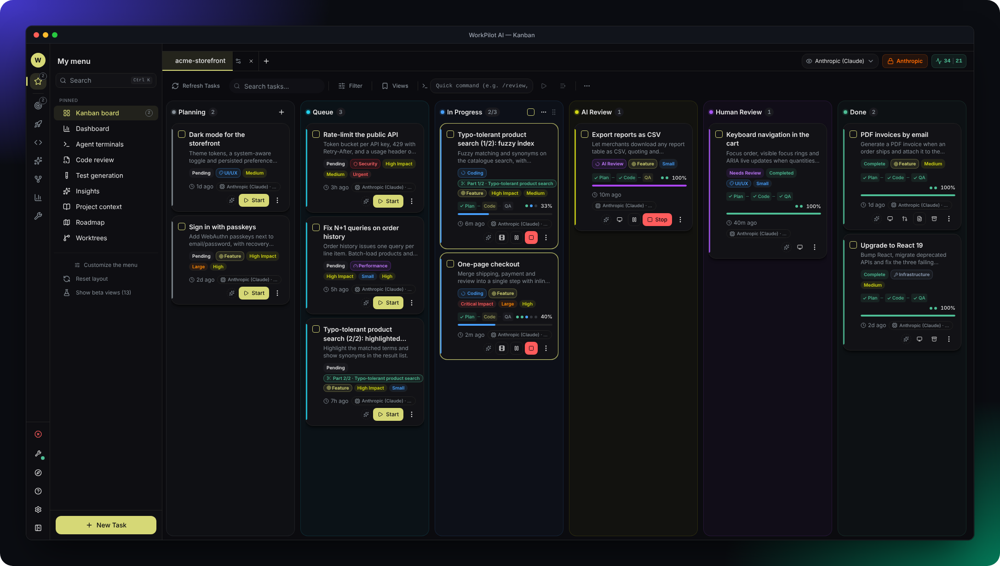
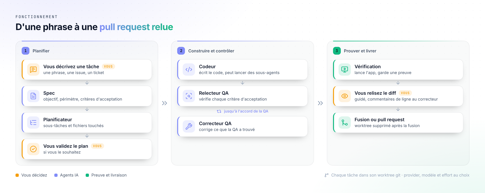
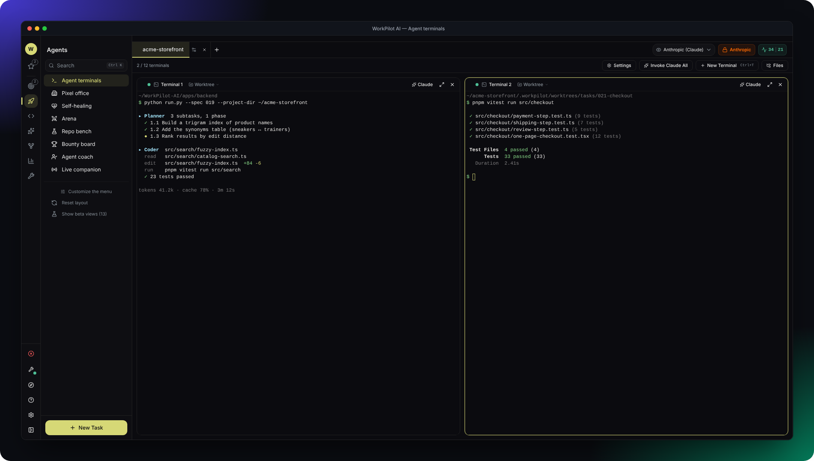
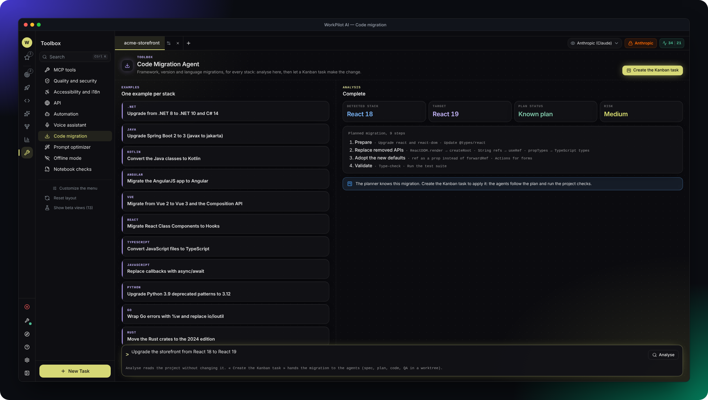
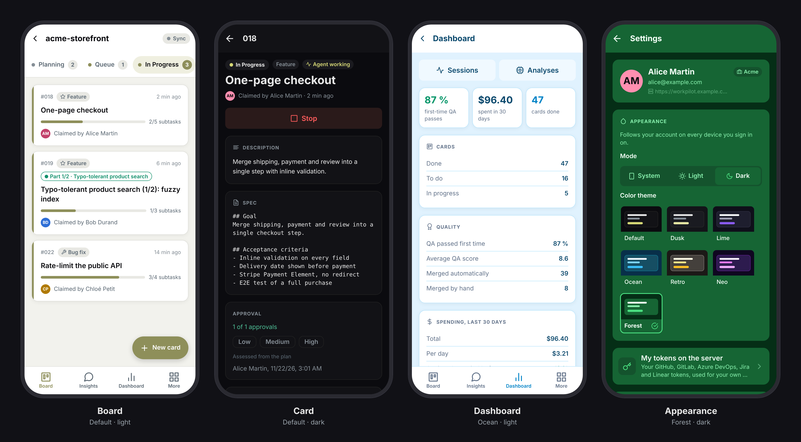
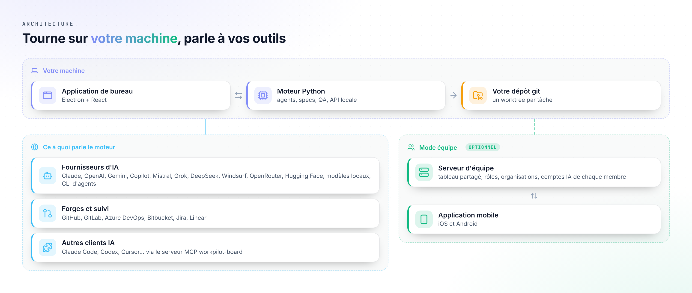

# WorkPilot AI

[English](README.md) · **Français**

**Décrivez ce que vous voulez construire. Une chaîne d'agents IA le planifie, le code, le teste et ouvre la pull request — chaque tâche dans son propre worktree git, avec le provider d'IA de votre choix.**

[](./LICENSE)
[](https://github.com/krovomi/WorkPilot-AI/releases/latest)
[](https://github.com/krovomi/WorkPilot-AI/discussions)
[](https://github.com/krovomi/WorkPilot-AI/wiki)
[](https://github.com/krovomi/WorkPilot-AI/actions)



**[Télécharger](#télécharger)** · **[Démarrage rapide](#démarrage-rapide)** · **[Fonctionnement](#fonctionnement)** · **[Visite](#visite-de-lapplication)** · **[Features](#les-features-en-bref)** · **[Providers d'IA](#providers-dia)** · **[Documentation](#documentation)**

WorkPilot AI est une application de bureau (Windows, macOS, Linux) avec un moteur Python, un serveur d'équipe optionnel et une app mobile. Elle fonctionne sur toutes les stacks : .NET, Java, Kotlin, Go, Rust, Python, Node.js et TypeScript (Angular, React, Vue, Next.js, Nuxt…), PHP, Ruby, Flutter, Swift, WinDev et d'autres.

> Les captures montrent l'interface en anglais ; l'application est entièrement disponible en français (Paramètres > Langue).

---

## Télécharger

### Version stable

<!-- STABLE_VERSION_BADGE -->
[](https://github.com/krovomi/WorkPilot-AI/releases/tag/v1.5.0)
<!-- STABLE_VERSION_BADGE_END -->

<!-- STABLE_DOWNLOADS -->
| Plateforme | Téléchargement |
|------------|----------------|
| **Windows** | [WorkPilot-AI-1.5.0-win32-x64.exe](https://github.com/krovomi/WorkPilot-AI/releases/download/v1.5.0/WorkPilot-AI-1.5.0-win32-x64.exe) |
| **macOS (Apple Silicon)** | [WorkPilot-AI-1.5.0-darwin-arm64.dmg](https://github.com/krovomi/WorkPilot-AI/releases/download/v1.5.0/WorkPilot-AI-1.5.0-darwin-arm64.dmg) |
| **macOS (Intel)** | [WorkPilot-AI-1.5.0-darwin-x64.dmg](https://github.com/krovomi/WorkPilot-AI/releases/download/v1.5.0/WorkPilot-AI-1.5.0-darwin-x64.dmg) |
| **Linux** | [WorkPilot-AI-1.5.0-linux-x86_64.AppImage](https://github.com/krovomi/WorkPilot-AI/releases/download/v1.5.0/WorkPilot-AI-1.5.0-linux-x86_64.AppImage) |
| **Linux (Debian)** | [WorkPilot-AI-1.5.0-linux-amd64.deb](https://github.com/krovomi/WorkPilot-AI/releases/download/v1.5.0/WorkPilot-AI-1.5.0-linux-amd64.deb) |
| **Linux (Flatpak)** | [WorkPilot-AI-1.5.0-linux-x86_64.flatpak](https://github.com/krovomi/WorkPilot-AI/releases/download/v1.5.0/WorkPilot-AI-1.5.0-linux-x86_64.flatpak) |
<!-- STABLE_DOWNLOADS_END -->

### Version bêta

> Les versions bêta peuvent contenir des bugs et des changements incompatibles. [Toutes les versions](https://github.com/krovomi/WorkPilot-AI/releases)

<!-- BETA_VERSION_BADGE -->
[](https://github.com/krovomi/WorkPilot-AI/releases)
<!-- BETA_VERSION_BADGE_END -->

<!-- BETA_DOWNLOADS -->
_Aucune version bêta n'est publiée pour le moment. Le tableau ci-dessus est la dernière version stable._
<!-- BETA_DOWNLOADS_END -->

> Chaque version contient les sommes de contrôle SHA256, un SBOM CycloneDX (`workpilot-sbom.cdx.json`) et une attestation de provenance de build pour chaque fichier (`gh attestation verify <fichier> --repo krovomi/WorkPilot-AI`) ; les résultats d'analyse VirusTotal sont ajoutés aux notes de version quand l'analyse est configurée.


---

## Démarrage rapide

1. **Installez** l'application pour votre plateforme depuis le [tableau de téléchargement](#télécharger).
2. **Ouvrez un projet** : n'importe quel dossier qui est un dépôt git.
3. **Connectez un provider d'IA** : un abonnement Claude, une clé d'API (OpenAI, Gemini, Grok, Mistral, DeepSeek), GitHub Copilot, un modèle local (Ollama, LM Studio) ou un agent CLI (Codex, OpenCode, pi…).
4. **Créez une tâche** sur le tableau Kanban et décrivez ce que vous voulez.
5. **Relisez le résultat** : les agents planifient, codent et valident ; vous approuvez le plan si vous le souhaitez, puis vous relisez le diff et fusionnez.

Depuis les sources (Node.js 22.12+, pnpm, Python 3.12+, Git) :

```sh
git clone https://github.com/krovomi/WorkPilot-AI.git
cd WorkPilot-AI
pnpm install
pnpm run dev
```

Installation pas à pas, configuration des providers, notes Windows et dépannage : [docs/INSTALLATION.md](docs/INSTALLATION.md).

---

## Fonctionnement

<picture>
  <source media="(prefers-color-scheme: dark)" srcset=".github/assets/showcase/how-it-works.fr-dark.png">
  
</picture>

- **Isolé** : chaque tâche tourne dans son propre worktree git, votre branche reste intacte jusqu'au merge ; le worktree est supprimé une fois la pull request de la tâche fusionnée.
- **Toujours relu** : les pages qui écrivent du code (studio de tests, Import Design, journal des modifications, pair programming, commandes rapides du Kanban) le déposent sur la branche d'une carte « Code généré » en Révision humaine ; il n'atteint votre projet que par une pull request que vous relisez ([code généré](docs/architecture/generated-review.md)).
- **Un workflow par type de tâche** : un bug est reproduit avant d'être corrigé, une investigation écrit un rapport et aucun code, un refactoring n'a pas le droit de toucher aux tests, un hotfix reçoit une revue indépendante ([types de tâches](docs/architecture/kanban-task-types.md)).
- **De petites pull requests** : une tâche qui dépasse le plafond de revue de son type se découpe d'elle-même en parties, une petite PR chacune, empilées quand elles dépendent l'une de l'autre ([découpage des tâches](docs/architecture/task-split.md)).
- **Des preuves, pas des avis** : après la QA, l'application modifiée par la tâche est lancée et pilotée (web, Electron, émulateur mobile, API, bureau Windows), et des portes strictes vérifient les dépendances ajoutées et que les tests détectent vraiment les défauts.
- **N'importe quel moteur** : changez de provider, de modèle ou d'effort par tâche, même en cours de route ; ce que chaque provider sait faire est déclaré dans [`capabilities/providers.yaml`](capabilities/providers.yaml).

---

## Visite de l'application

> Chaque capture vient de la vraie application, remplie avec un projet de démonstration inventé (`acme-storefront`), et est régénérée par [`scripts/readme-screenshots/`](scripts/readme-screenshots/).

**Tableau Kanban** (ci-dessus) : décrivez une tâche et suivez-la de la planification jusqu'à la pull request. Chaque carte montre sa phase, son avancement, le provider au travail et son sujet ; les parties d'une tâche découpée partagent une couleur et une marque « Partie k/N ». Les colonnes suivent le pipeline : Planification, File d'attente, En cours, Révision IA, Révision humaine, PR ouverte (tant qu'une pull request attend sa fusion), Terminé, plus Build rouge quand la CI du projet échoue sur la branche d'une tâche. La barre d'outils tient sur une ligne ; son menu « ⋯ » contient **Multi-dépôts** (un changement sur plusieurs dépôts) et **Purger** (libère la place prise par les worktrees des cartes terminées).

<table>
<tr>
<td width="50%" valign="top">

**Détail d'une tâche** : le plan découpé en sous-tâches avec les fichiers que chacune touche, les logs, les fichiers modifiés, les preuves visuelles et l'émulateur.


</td>
<td width="50%" valign="top">

**Terminaux d'agents** : jusqu'à 12 terminaux côte à côte, chacun dans le worktree d'une tâche, pour lancer des agents en parallèle à la main.



</td>
</tr>
<tr>
<td valign="top">

**Insights** : posez vos questions sur le code ; les réponses citent fichiers et lignes, et une trouvaille devient une tâche en un clic.


</td>
<td valign="top">

**Feuille de route** : vision produit, phases, priorités MoSCoW, concurrents et votes ; toute feature devient une tâche avec **Construire**.


</td>
</tr>
<tr>
<td valign="top">

**Idéation** : les agents parcourent le projet et proposent des améliorations par type, chacune avec sa justification et ses fichiers.


</td>
<td valign="top">

**Tableau de bord** : ce que les agents produisent et coûtent, par statut, provider et modèle ; exportable en JSON ou CSV.


</td>
</tr>
<tr>
<td valign="top">

**Visuel vers Code** : dessinez l'architecture en graphe de nœuds, chaque liaison expliquée et vérifiée, puis générez le projet.


</td>
<td valign="top">

**Import Design** : une maquette, une capture ou un export Figma devient des composants de la stack du projet, en six étapes visibles.
Le code est ensuite rendu, comparé à la maquette et corrigé jusqu'à lui ressembler, dans les itérations, le seuil et le budget en jetons ou en coût choisis, avec le score de chaque itération et les écarts restants ; sur demande, la version retenue est aussi contrôlée en mobile, tablette et bureau, et au survol et au focus, et ce que ces contrôles trouvent peut être renvoyé pour une correction de plus ; les zones tracées sur la maquette sont exclues du score ([boucle de rendu](docs/architecture/design-render-loop.md)).


</td>
</tr>
<tr>
<td valign="top">

**Studio de génération de tests** : trous de couverture, tests unitaires, E2E ou TDD, écrits en direct dans le framework de la stack du fichier.


</td>
<td valign="top">

**Paramètres** : réglages de l'application et du projet regroupés par thème, dans la même charte graphique que tous les modules, aux couleurs du thème actif.


</td>
</tr>
<tr>
<td valign="top">

**Comptes IA** : tous les providers sur une page, avec leur mode de connexion, s'ils répondent, leur usage et l'âge de leur clé ; une tâche arrêtée par une limite reprend sur le compte suivant de la chaîne de basculement, quel que soit le provider.


</td>
<td valign="top">

**Bac à sable** : un instantané du worktree de la tâche avant chaque session d'agent, restauré quand la surveillance des anomalies arrête une session ; mode d'écriture restreint et limites par session.


</td>
</tr>
<tr>
<td valign="top">

**Migration de code** : analysez une migration de framework, de version ou de langage sur n'importe quelle stack, lisez ses phases, ses étapes et son risque, puis confiez le plan à une tâche Kanban.



</td>
<td valign="top">

**Votre propre menu** : glissez une page sur un autre espace ou réordonnez vos épingles, ou passez par « Personnaliser le menu » au clavier ; le menu se redimensionne et, sur un serveur d'équipe, vous suit sur chaque poste.


</td>
</tr>
</table>

**App mobile (iOS et Android)** : avec un serveur d'équipe, le tableau partagé dans votre poche : ouvrir une carte, approuver un plan, lancer ou arrêter les agents, lire le tableau de bord, les Insights, la feuille de route et les idées.



---

## Les features en bref

La liste complète, avec chaque détail, est dans **[docs/FEATURES.md](docs/FEATURES.md)** (en anglais). Les vues marquées _expérimentales_ (une fiole sur leur icône) n'ont pas encore de document de conception ni de test ; elles sont réunies dans le **Labo** du menu, la fiole en bas du rail, et un bouton les masque toutes.

**Pipeline de construction**
- **Tableau Kanban** avec approbation de la spec, pause et reprise, relance par phase, messages de pilotage pendant que l'agent travaille, et une revue guidée avec des commentaires de ligne renvoyés au fixer ; des diffs aux couleurs de git, colorés selon le langage pour chaque stack, mots modifiés surlignés et disposition côte à côte « Auto ».
- Le **mode Essaim** construit côte à côte les sous-tâches que le plan permet, chacune dans son propre worktree, fusionnées dans la branche de la tâche après chaque vague.
- **Découpage automatique** des grosses tâches en petites PR groupées, **tâches empilées**, **Best-of-N** (construire une tâche 2 à 4 fois sur des moteurs différents et garder la meilleure, avec un arbitre quand les variantes ne font pas la même chose) et changements **multi-dépôts**, sur le provider, le modèle et l'effort choisis pour eux.
- L'**essai à blanc** rejoue le plan d'une spec sur la branche de base avant le build ; après la QA, un agent **red team** essaie de casser ce que la tâche a construit, et la **garde des migrations** dit ce que les migrations de la tâche feraient à une base en production, pour toutes les stacks.
- **Mode objectif** (terminé quand une commande le dit, par exemple `dotnet test` qui sort en 0), **revue croisée** par un second moteur, **spec par l'exemple** pour les Web API ASP.NET Core, **montées de version .NET** une version à la fois jusqu'à .NET 11.
- **Vérification à l'exécution** avec vidéos de preuve et comparaison avec la branche de base ; **portes strictes** contre les paquets inventés, les tests sans mordant et pour les preuves formelles ; [REA](docs/architecture/rea.md) lit le build laissé par une tâche, sans le lancer, et signale ce qu'il expose, et en .NET une API publique que la tâche a cassée.
- **Matrice d'appareils** dans l'émulateur : la page affichée, rendue sur plusieurs téléphones, tablettes, ordinateurs et un téléviseur à la fois (fenêtre, densité, user agent, tactile), côte à côte, au besoin sur un réseau bridé (4G, 3G rapide, 3G lente) et un processeur ralenti, avec les bugs responsive classiques signalés sur chacun : défilement de côté, médias trop larges, cibles tactiles de moins de 44 px, texte de moins de 12 px, éléments qui se chevauchent, texte coupé, navigation mobile inaccessible, chacun encadré sur la capture ; téléphones et tablettes aussi en paysage, au besoin avec les cookies de l'aperçu pour une page derrière une connexion, ouverte d'elle-même sur quatre appareils à la revue d'une carte dont les changements touchent l'interface ; la grille s'exporte en PNG ou en PDF ([matrice d'appareils](docs/architecture/device-matrix.md)).
- **Enregistreur du Browser Agent** : pilotez une page à la main et obtenez un test Playwright (TypeScript ou Python), Cypress, Selenium (Python ou Java) ou WebdriverIO qui traverse iframes et shadow roots et attend ce que chaque action a provoqué, avec des sélecteurs robustes et les secrets lus dans des variables d'environnement, proposé sur une branche de revue.
- Projets **WinDev, WebDev et WinDev Mobile** sauvegardés au format texte : les agents ne modifient que le code WLangage, une porte de la QA renvoie tout ce que seul l'éditeur peut écrire, et le WLangage est coloré dans la vue des diffs ([WinDev](docs/architecture/windev.md)).
- **Suivi des PR** : un check rouge ou un fil de revue sur la PR de la tâche repart vers le fixer, jamais forcé, jamais fusionné.
- **Provenance** : quelles lignes l'IA a écrites et avec quel modèle, un SBOM des paquets ajoutés, la traçabilité exigence-test.
- **Garde-fous en code** : une politique versionnée, par couches, que les agents ne contournent pas, appliquée aussi dans les worktrees des tâches ; chaque résultat d'outil est analysé contre l'injection de prompt avant que l'agent ne le lise.
- **Failles de sécurité classées par ce qui tourne** : le scan de sécurité de la QA range ses trouvailles en critiques et exposées, critiques mais dormantes, moyennes et informatives, d'après ce que vos points d'entrée atteignent (tout langage) et les incidents de production des 30 derniers jours dans `.workpilot/incidents/` (Sentry, Datadog, CloudWatch, New Relic…) ; le fixer voit d'abord les exposées, et ce qui bloque un build suit toujours la gravité.

**Agents et orchestration**
- **Vagues d'exécution** (Mission Control) : les specs en attente sont regroupées en vagues qui ne partagent aucun fichier, d'après leurs plans, leurs worktrees, les fichiers que l'historique git modifie ensemble, les imports croisés et les symboles supprimés, vérifiées par un merge de test, puis lancées vague après vague dans l'ordre de merge, avec le parallélisme du projet ; une exécution interrompue par un redémarrage peut être reprise, et les 14 derniers jours d'exécutions montrent les conflits évités ; aucun modèle n'est appelé.
- **Composition automatique** (Mission Control) : une équipe d'agents proposée d'après une description, la spec d'une tâche ou un modèle de session (bug, fonctionnalité, refonte, incident), sur les providers choisis et mélangés, modèles filtrés par leurs capacités, coûts du catalogue Cost Intelligence, équipe moins chère sous un budget ; pendant le travail, un agent bloqué passe à un autre provider ou à un modèle plus puissant, et les sessions passées calibrent les estimations.
- **Mission Control** pour lancer plusieurs agents sur un même objectif, **terminaux d'agents**, **Arène** et **Bounty Board** pour comparer les moteurs, **Repo bench** pour les mesurer sur vos propres tâches passées.
- **Pixel Office** montre vos agents en personnages pixel art à leur bureau, gagne des succès à partir de ce que le projet livre (tâches livrées, QA passée à la première revue, incidents résolus, accord d'un second moteur) sur tous les providers, vit des **saisons** de trois mois dont les objectifs d'équipe décorent le bureau, raconte une courte scène quand une tâche change de mains (écrite au choix par le modèle de la page, qui ne voit jamais le contenu de la tâche), habille chaque personnage aux couleurs de son fournisseur, et propose un **mode TV** pour l'écran d'une équipe, avec un mode calme qui arrête les animations.
- **Rejeu d'agent** partage une session enregistrée : un fichier `.wpreplay` qu'un collègue importe, ou une page HTML que chacun ouvre sans WorkPilot, secrets et dossiers locaux masqués et, sur demande, sans le raisonnement, les tokens ou le contenu des fichiers ; des signets annotés marquent les étapes qui comptent. La page s'exporte aussi en vidéo WebM jouée étape par étape, et une session dont le modèle n'a laissé aucun raisonnement reçoit, à la demande, un court résumé de ses étapes par le modèle rapide du provider par défaut.
- Agents spécialisés : générateur de tests, détective de tests instables (avec la cause et une carte de correction), refactoreur, docs et dérive, accessibilité (score WCAG 2.2 et corrections), i18n, veille des contrats d'API, preuves de conformité, notebooks (dépendances entre cellules, exécution en noyau neuf), migration, auto-guérison sur échec de CI, suivi de la dette technique ; leurs corrections vont sur une branche de revue, jamais directement dans votre dossier.
- **Une auto-guérison qui regarde plus loin que le dernier commit** : tendances de risque par fichier d'un scan à l'autre (liste des fichiers qui chauffent vite, dossiers qui se dégradent ensemble), erreurs de production de plusieurs outils de supervision groupées en un incident par bug avec ses commits suspects, et bisect d'un échec de CI dans un worktree temporaire qui nomme au correcteur le premier commit fautif.
- Le **Release Train** livre lui-même vos services, dans l'ordre des dépendances, avec contrôles de santé et smoke tests et un clic par service de production ; le **chirurgien de l'historique Git** nettoie les commits d'une branche sur une nouvelle branche, au code identique.
- **Pair programming avec une IA participante** : invitez WorkPilot IA dans une salle ; elle répond avec le provider choisi et propose du code en suggestion sur le fichier de la salle, sans jamais l'écrire ; sur un serveur d'équipe, `@ia` dans le chat d'équipe reçoit une réponse de l'IA.
- **Coach personnel** : il apprend votre style de code par langage à partir de votre historique git et de la config du lint, et donne vos préférences nettes au codeur et au correcteur QA.
- **Mémoire partagée** : un coffre Obsidian et un graphe que tous les agents lisent et écrivent, entre sessions et providers ; chaque décision sur la mémoire (créée, oubliée, restaurée, épinglée, fusionnée) est journalisée avec son auteur et sa raison et peut être reprise (la dernière décision automatique dans l'heure, une fusion à tout moment), une note oubliée reste 30 jours à la corbeille, et une synchronisation d'équipe qui contredit une note est signalée, une paire qui oscille allant aux mainteneurs que l'équipe désigne, et une mémoire peut être limitée à une partie du code ([cycle de vie de la mémoire](docs/architecture/memory-lifecycle.md)) ; la boucle d'apprentissage analyse chaque build avec un modèle du provider choisi, et ses leçons atteignent la spec, le plan, le code et la QA ; des packs de **skills** indépendants du provider.
- **Leçons appliquées, par tâche** : le panneau de la tâche liste les règles adoptées, les motifs appris et les points de contrôle de son type (correctif, refactoring, montée de version…) que chaque prompt de la tâche a reçus, et chacun se désactive pour cette tâche seule ; les points de contrôle d'un type n'entrent dans sa spec que si l'historique QA du dépôt montre que les specs de ce type reviennent.

**Comprendre et planifier**
- **Insights**, **Idéation**, **Feuille de route**, visualiseur d'architecture avec la dérive d'architecture pour chaque grande stack (couches déduites des projets .NET, des modules Maven/Gradle et des paquets Go, Rust, PHP, Dart et Swift), règles de revue de code et code smells pour chaque grande stack, classificateur de risque.
- **Migration de code** de frameworks, de versions et de langages : le plan (phases, étapes, risque) s'affiche, puis une tâche Kanban l'applique.
- **Visuel vers Code**, **Import Design**, **générateur de pipelines** (GitHub Actions, GitLab CI, Azure Pipelines, Bitbucket, CircleCI) et un **assistant vocal** (Ctrl+Maj+Espace, une pédale sur F13–F24, ou un mot d'éveil optionnel) qui peut écouter en continu, répondre à voix haute avec les voix du système, suivre une tâche en cours et transmettre vos consignes parlées à son agent, et arrêter les agents en cours après leur étape quand on dit « stop ».

**Intégrations**
- GitHub, GitLab, Azure DevOps, Jira et Linear : importer des tickets, les investiguer, relire des pull requests.
- **Revue de PR par l'IA qui apprend** : accepter, rejeter ou marquer non applicable chaque résultat, avec une raison ; un type de remarque que le projet rejette sans cesse est rétrogradé, puis n'est plus remonté, sur tous les providers, revues de suivi comprises ; jamais un résultat de sécurité ou critique. Une vue par projet donne le taux d'acceptation par catégorie, réinitialise une règle apprise et écrit `.workpilot/review-conventions.md`. Sur un projet serveur, le rejet d'un membre attend le propriétaire du projet. Avant son verdict, une revue fond une remarque faite deux fois au même endroit ([retours de revue](docs/architecture/review-feedback.md)).
- Les **automatisations** transforment un événement (un ticket étiqueté, une CI rouge, une heure de la journée, un incident de production venu de Sentry) en carte brouillon ; les **déclencheurs CI/CD** lancent votre pipeline (GitHub Actions, GitLab CI, Azure Pipelines, Jenkins) quand un agent ouvre la PR d'une tâche ou quand elle est fusionnée, puis **surveillent le déploiement** (health check et métriques Prometheus comparés à leur niveau d'avant) et proposent, ou lancent, un **rollback** vers la dernière exécution réussie ; un mauvais verdict donne un **rapport d'incident** (les chiffres, puis quelques phrases de votre modèle), une notification et, sur demande, une **PR de revert** du commit déployé sur votre forge.
- Marketplace MCP et serveurs MCP personnalisés avec descriptions d'outils épinglées ; chaque serveur du catalogue affiche un **score de sécurité** sur 100 (éditeur, permissions des outils, version épinglée, date de version, vulnérabilités connues via OSV, changement de mainteneurs, analyse statique du code lancé), les serveurs installés sont revérifiés chaque jour avec des alertes à acquitter, et un projet peut restreindre ce qui s'installe (`.workpilot/mcp-policy.json`) ; le serveur MCP **workpilot-board** donne votre Kanban à Claude Code, Codex, Gemini CLI, Copilot, Cursor et d'autres.
- Notifications sur Slack, Teams, Discord, Google Chat, webhooks, ntfy et Telegram.

**Équipe**
- **Mode serveur** : un serveur pour l'équipe, toutes les features partagées en direct, organisations isolées, rôles, groupes et administrateurs, connexion JWT, Microsoft Entra ou tout fournisseur OpenID Connect (Okta, Google, Keycloak…), spec approuvée par une autre personne que l'auteur de la carte, par autant d'approbateurs que sa criticité en demande, approbations prêtées pendant une absence ([guide d'exploitation](docs/server-operations.md)).
- **App mobile** pour iOS et Android, chat d'équipe, inscription sur invitation uniquement.

**Coûts et suivi**
- Budgets de coût appliqués pendant l'exécution : un budget du projet par période et un plafond par tâche, vérifiés avant chaque session d'agent sur tous les fournisseurs ; la tâche se met en pause à son plafond, peut passer à un modèle plus léger du même fournisseur, et une tâche qui dépense sans avancer est mise en pause elle aussi.
- Coupe-circuit et arrêt d'urgence : un agent qui répète le même appel d'outil avec le même résultat est mis en pause sur tous les fournisseurs, et « Arrêter tous les agents » (bouton de la barre latérale, Ctrl+Maj+.) met en pause chaque tâche en cours, à reprendre depuis sa carte.
- Gouvernance dans `workpilot.policy.yaml` : heures permises dans un fuseau explicite, fichiers interdits ou soumis à revue, budgets de jetons par heure et par tâche, limite du coupe-circuit, appliqués à chaque agent sur tous les fournisseurs et entre les vagues du Swarm ; un fichier invalide met chaque tâche en pause, et chaque décision (coupe-circuit compris) entre dans un journal d'audit, compté par jour et par semaine, exportable en CSV ou JSON depuis Réglages > Garde-fous.
- Smart Estimation qui apprend chaque dépôt : l'estimation d'une tâche est corrigée par ce qu'ont réellement consommé ses specs fusionnées (coût, tokens, itérations de QA, fichiers modifiés), affichée en fourchette avec sa confiance et un détail par dimension, avec votre propre ajustement et une remise à zéro ; tous les providers alimentent le même historique.
- Tableau de bord analytique avec « Où vous en êtes » (un projet comparé à son passé et à vos autres projets de même pile, de même taille et de même équipe, par spec et par type de travail, avec les 10 % les meilleurs, une courbe par semaine et un rapport d'équipe en PDF, sans rien envoyer), estimateur de coûts, Formula Lab (estimation du coût et de la réussite par provider, modèle et effort), moniteur de limites de débit avec bascule de compte, profileur carbone avec un budget mensuel et un export ESG, traces OpenTelemetry GenAI pour chaque provider.

**Apparence**
- Une seule charte graphique dans tous les modules, qui suit le thème actif : 7 thèmes de couleur en clair et en sombre plus un éditeur de thème, interface complète en anglais et en français.
- Un menu léger : un rail d'espaces avec un seul panneau à la fois, arrangé par chacun (glisser une page sur un autre espace, réordonner les épingles, ou « Personnaliser le menu » au clavier) et redimensionnable à la souris, « Mon menu » pour les pages épinglées et récentes, quatre hubs dans la Boîte à outils, les pages bêta dans un **Labo**, une proposition de masquer les pages inutilisées depuis 30 jours, les outils CLI dans une pastille ; la palette de commandes (Ctrl+K ou `/`) trouve chaque page par son nom, son groupe ou un mot-clé.
- Un assistant de premier lancement qui configure n'importe quel provider d'IA et dit honnêtement lesquels sont connectés.

---

## Providers d'IA

| Provider | Connexion |
|----------|-----------|
| **Anthropic Claude** | Connexion Claude Code (abonnement), ou un profil d'API : une URL de base et son jeton |
| **OpenAI** | Clé d'API, ou la CLI Codex connectée |
| **Google Gemini** | Clé d'API, ou Gemini CLI via l'Agent Client Protocol |
| **Grok (xAI)**, **Mistral**, **DeepSeek** | Clé d'API |
| **GitHub Copilot** | Connexion GitHub (abonnement Copilot) |
| **Windsurf** | Clé d'API, ou la clé de l'IDE Windsurf installé |
| **Modèles locaux** | Ollama, LM Studio ou llama.cpp, sans clé |
| **Agents CLI** | Codex, OpenCode, Antigravity, pi, Hermes : installés et mis à jour en un clic depuis la barre latérale **Outils CLI** |

Plusieurs comptes peuvent être enregistrés par provider. Avec le basculement automatique, une tâche arrêtée par une limite de débit ou une connexion perdue reprend sur le compte suivant de la chaîne que vous ordonnez (comptes Claude, profils API, Copilot, OpenAI, Mistral, Ollama…), à la phase où elle s'est arrêtée. La répartition de l'utilisation nomme le forfait de chaque compte tel que le fournisseur l'indique (Claude Pro ou Max, ChatGPT Plus ou Pro, Copilot…) ou dit qu'il est facturé par clé API. Les clés sont stockées dans le trousseau du système et affichées masquées ; l'interface ne reçoit jamais leur valeur. Meta, AWS et Cursor peuvent être configurés mais n'ont pas encore de client d'agent : leurs builds tournent sur Claude, et la tâche le signale. Variables et valeurs par défaut : [docs/CONFIGURATION.md](docs/CONFIGURATION.md) (en anglais).

---

## Architecture

Comment les pièces communiquent :

<picture>
  <source media="(prefers-color-scheme: dark)" srcset=".github/assets/showcase/architecture.fr-dark.png">
  
</picture>

Où elles vivent dans le dépôt :

| Dossier | Contenu |
|---|---|
| `apps/backend/` | Agents Python, specs, QA, API locale, mode serveur |
| `apps/frontend/` | App de bureau Electron (React + TypeScript) |
| `apps/mobile/` | App iOS et Android (Expo), cliente du mode serveur |
| `src/` | Connecteurs Python partagés (Jira, Azure DevOps…) |
| `capabilities/` | Ce que sait faire chaque provider et harness |
| `config/` | Liste des providers affichée dans les Paramètres |
| `workflows/` | Un workflow déclaratif par type de tâche |
| `skills/` | Packs de skills (`.agents/skills/` est généré) |
| `deploy/` | Image serveur et docker-compose |
| `changelog.d/` | Un fragment de changelog par pull request |
| `docs/` | Règles, justifications de conception, guides |
| `tests/` | Tests Python (les tests frontend sont à côté du code) |
| `scripts/` | Scripts de build, de release et de maintenance |

Comment les pièces s'assemblent (agents, sous-agents, workflows, état, couches de sécurité) : [docs/ARCHITECTURE.md](docs/ARCHITECTURE.md). Pourquoi chaque feature est construite ainsi : [docs/architecture/](docs/architecture/). Un atlas guidé et cliquable, lisible sans bagage technique : [docs/audit/WorkPilot-architecture.html](docs/audit/WorkPilot-architecture.html). Les instructions pour les agents de code commencent à [`AGENTS.md`](AGENTS.md).

### Ligne de commande

```bash
cd apps/backend
python runners/spec_runner.py --interactive   # Créer une spec en mode interactif
python run.py --spec 001                      # Lancer le build autonome
python run.py --spec 001 --review             # Relire
python run.py --spec 001 --merge              # Fusionner
```

Référence complète : [docs/CLI-USAGE.md](docs/CLI-USAGE.md) (en anglais).

---

## Sécurité

1. **Bac à sable du système** : les commandes des agents tournent sous bubblewrap (Linux) ou Seatbelt (macOS) ; Windows n'est pas encore couvert, et la carte indique quand une tâche tourne sans bac à sable.
2. **Restrictions du système de fichiers** : les opérations restent dans le dossier du projet.
3. **Liste blanche dynamique de commandes** : seules les commandes de la stack détectée sont autorisées.
4. **Instantanés et score de confiance** : avant chaque session d'agent, le worktree de la tâche est enregistré comme un commit git caché ; chaque session démarre avec un score de confiance de 100 que les anomalies font baisser, et sous un seuil la tâche se met en pause, ou la session s'arrête et son instantané est restauré. Le mode restreint et les limites par session sont dans Paramètres > Sandbox ; un instantané se restaure depuis la carte.

Les clés d'API et les jetons sont chiffrés au repos avec le trousseau du système ; Paramètres > Comptes indique depuis quand chaque clé d'API a été enregistrée et suggère de la renouveler après 90 jours. Chaque version fournit les sommes de contrôle SHA256, un SBOM CycloneDX et une attestation de provenance de build par fichier.

Pour signaler une vulnérabilité, suivez [docs/SECURITY.md](docs/SECURITY.md), jamais un ticket public. Les règles que suivent les contributeurs et les agents de code sont dans [docs/rules/security.md](docs/rules/security.md).

---

## Documentation

| Document | Contenu |
|----------|---------|
| [Features](docs/FEATURES.md) | Chaque feature, par domaine (en anglais) |
| [Installation](docs/INSTALLATION.md) | Prérequis, méthodes d'installation, configuration des providers, notes Windows, dépannage |
| [Configuration](docs/CONFIGURATION.md) | Registre des providers, résolution des identifiants, variables d'environnement (en anglais) |
| [Utilisation en CLI](docs/CLI-USAGE.md) | Usage sans interface et en CI (en anglais) |
| [Architecture](docs/ARCHITECTURE.md) | Agents, workflows, état et couches de sécurité |
| [Justifications de conception](docs/architecture/) | Pourquoi chaque feature est construite ainsi, un fichier par feature |
| [Exploitation du serveur](docs/server-operations.md) | Faire tourner le serveur d'équipe : déploiement, TLS, sauvegardes, mises à jour, quotas |
| [Linux](docs/linux.md) · [Développement sous Windows](docs/windows-development.md) | Notes par plateforme (en anglais) |
| [Contribuer](docs/CONTRIBUTING.md) | Environnement de développement, style de code, tests, pull requests (en anglais) |
| [Processus de release](docs/RELEASE.md) | Comment les versions sont préparées et publiées (en anglais) |
| [Politique de sécurité](docs/SECURITY.md) | Versions supportées, signaler une vulnérabilité (en anglais) |
| [Plan de la documentation](docs/README.md) | Où vit chaque document et à quoi il sert |
| [Wiki](https://github.com/krovomi/WorkPilot-AI/wiki) | Guides utilisateur, rafraîchis après chaque version |

---

## Contribuer et communauté

Les contributions sont les bienvenues : commencez par [docs/CONTRIBUTING.md](docs/CONTRIBUTING.md). Les pull requests ciblent `develop`. Les nouvelles versions sortent toutes seules, au plus une fois par jour : le pilote de release déduit majeure, mineure ou patch des pull requests fusionnées, écrit la documentation de la version et fusionne `develop` dans `main` ([processus de release](docs/RELEASE.md#automatic-releases-release-autopilot)).

- **Tickets** : [signaler un bug ou demander une feature](https://github.com/krovomi/WorkPilot-AI/issues)
- **Discussions** : [poser une question](https://github.com/krovomi/WorkPilot-AI/discussions)

---

## Licence

**AGPL-3.0**, GNU Affero General Public License v3.0. WorkPilot AI est libre d'utilisation. Si vous le modifiez et le distribuez, ou le faites tourner comme service, votre code doit aussi être open source sous AGPL-3.0. Une licence commerciale est disponible pour les usages en source fermée.

[](https://github.com/krovomi/WorkPilot-AI/stargazers)

[](https://star-history.com/#krovomi/WorkPilot-AI&Date)
